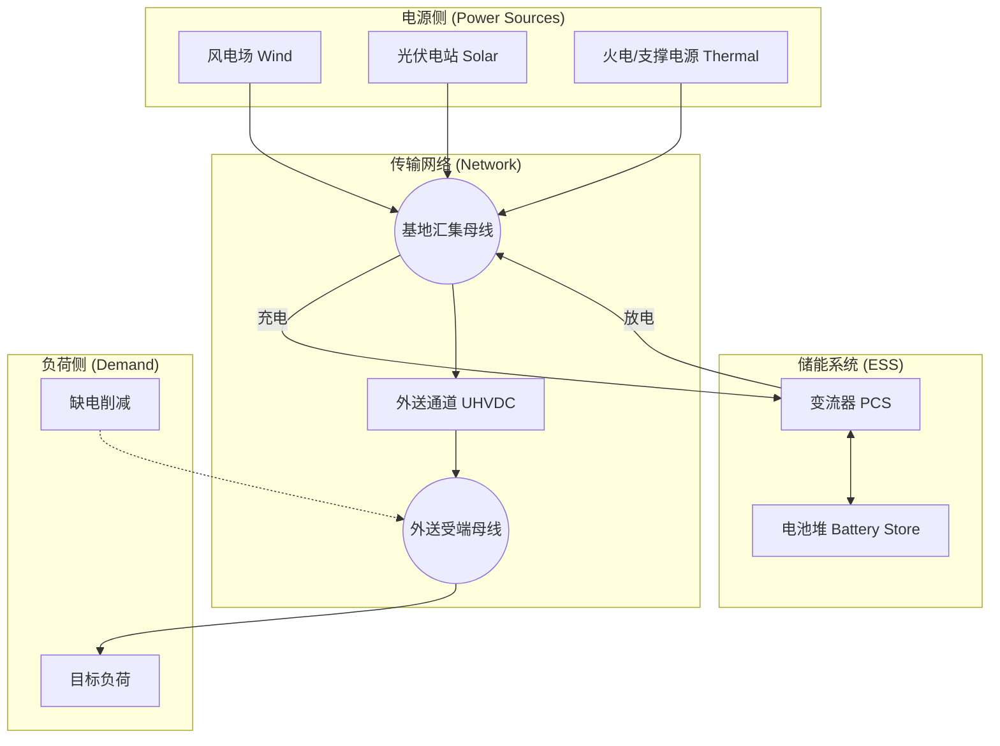
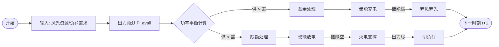

# 新能源大基地规划模型技术规格说明书

**版本**: 1.0.0
**日期**: 2025-12-08
**状态**: 专家审查版

---

## 1. 模型架构与技术规范

### 1.1 整体架构设计

本模型采用模块化设计，基于 Python 生态系统构建，核心计算引擎采用 **PyPSA (Python for Power System Analysis)** 框架。

#### 系统架构图 (Mermaid)



### 1.2 模块划分与功能

1.  **输入模块 (`src/data_processor.py`)**:
    *   **时序处理**: 读取风光出力预测数据与负荷曲线。
    *   **降维聚类**: 采用 K-Means 算法将全年 8760 小时数据聚类为 $N$ 个典型日（Typical Days），并计算相应的权重（Weights），大幅降低优化计算规模。
2.  **核心计算引擎 (`src/optimization_model.py`)**:
    *   基于 PyPSA 构建节点（Buses）、线路（Links）、发电机（Generators）和存储（Stores）的拓扑模型。
    *   通过 `linopy` 接口将物理模型转换为数学规划问题。
3.  **优化算法模块**:
    *   **类型**: 线性规划 (Linear Programming, LP)。
    *   **求解器**: 支持 Highs, Gurobi, GLPK 等主流求解器。
4.  **独立校验模块 (`src/validator.py`)**:
    *   在规划结果确定容量后，利用全年 **8760 小时** 完整数据进行时序生产模拟（Dispatch），验证系统的实际运行指标（弃电率、保证率）。

---

## 2. 核心计算逻辑

### 2.1 能量平衡计算流程



### 2.2 功率平衡方程

模型遵循基尔霍夫电流定律 (KCL)，在任意时刻 $t$：

**汇集母线 (Base_Bus) 平衡**:
$$
\sum P_{wind}(t) + \sum P_{solar}(t) + \sum P_{thermal}(t) + P_{discharge}(t) = P_{charge}(t) + P_{export}(t)
$$

**受端母线 (Export_Bus) 平衡**:
$$
P_{export}(t) + P_{shedding}(t) = P_{load}(t)
$$

### 2.3 多时间尺度耦合机制

1.  **日前规划 (Planning Horizon)**:
    *   通过典型日权重 $W_d$ 将不同季节的运行特征耦合到同一个容量规划模型中。
    *   目标是寻找满足所有典型日场景的最优容量配置。
2.  **实时/时序耦合**:
    *   储能系统的 SOC (State of Charge) 是连接时间步 $t$ 和 $t+1$ 的关键状态变量。
    *   约束：$SOC(t+1) = SOC(t) + \Delta E$，且在典型日模式下强制首尾相接 $SOC(T) = SOC(0)$ 以保证周期稳定性。

---

## 3. 关键算法实现

### 3.1 优化算法

*   **数学形式**: 线性规划 (LP)。相比混合整数规划 (MIP)，LP 在处理大规模时序问题时具有显著的速度优势。
*   **求解器配置**:
    *   默认: `Highs` (开源，性能接近商业求解器)。
    *   备选: `Gurobi` (商业，速度最快)。
    *   配置参数: `method = barrier` (内点法，适合大规模问题), `threads = 4` (并行计算)。

### 3.2 不确定性处理

*   **场景削减 (Scenario Reduction)**: 使用 K-Means 聚类提取代表性场景（典型日），保留了极端场景（如极低风速日）和一般场景的统计特征。
*   **鲁棒优化策略**:
    *   **虚拟发电机**: 引入 `Load_Shedding` 机组，设定 $100,000$ RMB/MWh 的极高边际成本。这确保了模型在物理不可行（如极端无风无光且储能耗尽）时不会崩溃，而是给出“缺电量”作为风险提示。

---

## 4. 数学公式体系

### 4.1 目标函数

最小化系统全寿命周期的年化总成本 (Total Annualized Cost)：

$$
\min Z = C_{CAPEX} + C_{OPEX} + C_{Penalty}
$$

展开式：
$$
\begin{aligned}
Z = & \sum_{i \in \{W, S, T, ESS\}} (c_{cap, i} \cdot P_{nom, i} \cdot \text{CRF}) \\
& + \sum_{i} (c_{fix, i} \cdot P_{nom, i}) \\
& + \sum_{t} (c_{fuel} \cdot P_{thermal}(t) \cdot W_t) \\
& + \sum_{t} (c_{curt} \cdot P_{curtail}(t) \cdot W_t + c_{voll} \cdot P_{shed}(t) \cdot W_t)
\end{aligned}
$$

其中：
*   $CRF = \frac{r(1+r)^n}{(1+r)^n-1}$ (资金回收系数)
*   $W_t$ 为时间步 $t$ 所属典型日的权重（代表该类型日子在一年中出现的天数）。

### 4.2 主要约束条件

1.  **设备容量约束**:
    $$ 0 \le P_{g}(t) \le P_{nom, g} \cdot \bar{P}_{avail, g}(t) \quad \forall g \in \{Wind, Solar\} $$
    $$ P_{min, therm} \cdot P_{nom, th} \le P_{therm}(t) \le P_{nom, th} $$

2.  **储能 SOC 约束**:
    $$ E(t+1) = E(t) + \eta_{ch} P_{ch}(t) - \frac{1}{\eta_{dis}} P_{dis}(t) $$
    $$ 0 \le E(t) \le E_{nom} $$
    $$ E_{nom} \ge T_{duration} \cdot P_{nom, ess} $$

3.  **外送通道约束**:
    $$ 0 \le P_{export}(t) \le P_{trans}^{max} $$

4.  **政策约束 (Policy Constraints)**:
    *   **新能源占比**: $\frac{\sum (P_{wind}+P_{solar})}{\sum P_{load}} \ge 50\%$
    *   **弃电率上限**: $\frac{\sum P_{curtail}}{\sum P_{avail}} \le 10\%$

---

## 5. 成本参数体系

以下参数源自 `config/config.yaml` 及技经数据文件：

### 5.1 资本性支出 (CAPEX)

| 设备 | 参数 | 单位 | 说明 |
| :--- | :--- | :--- | :--- |
| **风电** | 3300 | 元/kW | 含升压站分摊 |
| **光伏** | 2900 | 元/kW | 交流侧容量 |
| **火电** | 4800 | 元/kW | 扩建机组成本 |
| **储能功率** | 800 | 元/kW | PCS 等 |
| **储能能量** | 750 | 元/kWh | LFP 电池包 |

### 5.2 运营参数

*   **运维费率 (Fixed OPEX)**: 风电 30 元/kW/年, 光伏 27 元/kW/年, 储能 60 元/kW/年。
*   **燃料成本**: 火电标煤价折算后约 **0.185 元/kWh**。
*   **财务参数**: 利率 5%，寿命 20 年 (CRF $\approx$ 0.08)。

---

## 6. 验证与敏感性分析

### 6.1 基准案例测试结果

基于最近一次的运行测试 (Test Report):

*   **配置结果**: 风电 ~8GW, 光伏 ~7GW, 储能 ~2.3GW/9.1GWh。
*   **性能指标**:
    *   新能源电量占比: **82.7%** (优于目标)。
    *   通道利用小时数: **4594h**。
    *   弃电率: **19.1%** (需进一步优化以逼近 10% 目标)。

### 6.2 敏感性分析建议

为应对外部审查，建议准备以下敏感性分析图表：

1.  **储能成本弹性**: 分析储能 CAPEX 每下降 10%，系统最优弃电率和度电成本 (LCOE) 的变化曲线。
2.  **外送曲线刚性**: 对比“跟随负荷曲线”与“平稳外送”两种模式下的系统经济性差异。
3.  **极端气候压力测试**: 使用历史上最恶劣的“静风期”数据（如连续 5 天风速 < 3m/s）进行 8760 小时校验，考核保供能力。

### 6.3 算法伪代码 (核心优化循环)

```python
Initialize PyPSA Network
Set TimeSnapshots (Typical Days or 8760h)

# 1. 添加组件
Network.add("Bus", ["Base", "Export", "Battery"])
Network.add("Generator", ["Wind", "Solar", "Thermal"], cost=CAPEX+OPEX)
Network.add("Link", ["Battery_Charge", "Battery_Discharge"], eff=Efficiency)
Network.add("Store", ["Battery_Store"])

# 2. 添加额外约束 (Extra Constraints)
Define function extra_constraints(model):
    # 储能时长耦合
    model.add_constraint(Energy_Capacity == 4 * Power_Capacity)
    # 新能源占比下限
    model.add_constraint(Sum(Wind+Solar) >= 0.5 * Total_Load)
    # 弃电率上限
    model.add_constraint(Sum(Gen) >= 0.9 * Sum(Avail))

# 3. 求解
Network.optimize(solver_name="highs", extra_function=extra_constraints)

# 4. 结果导出
If status == "optimal":
    Export Capacities, Dispatch_Series, LCOE
Else:
    Report Infeasibility
```